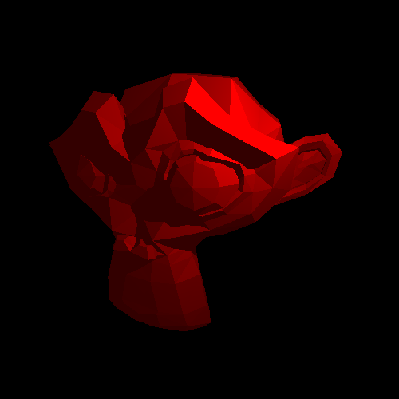
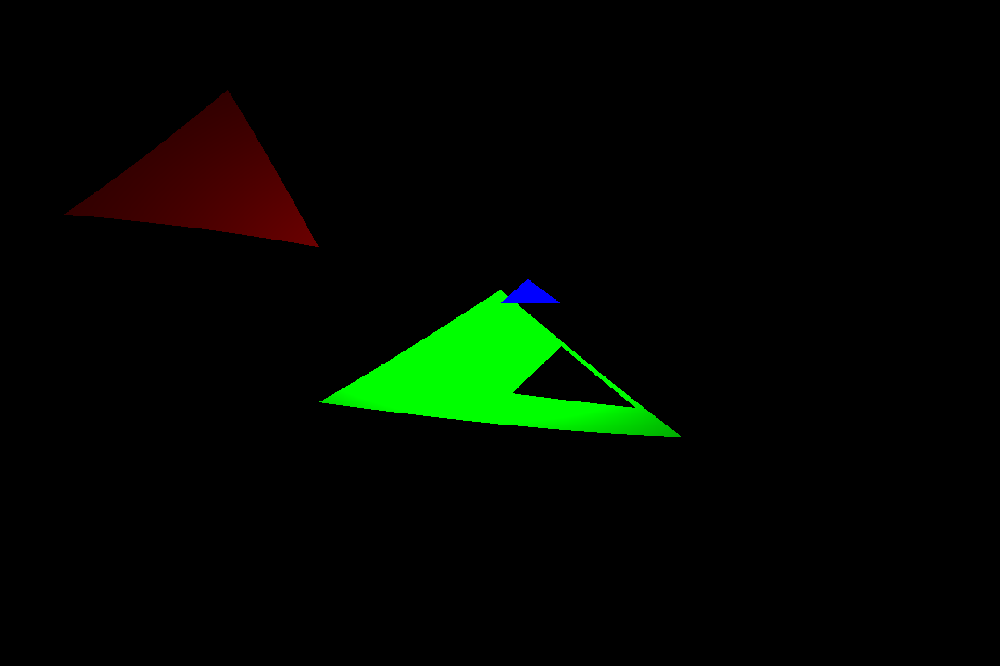

# Raytracer

I'm making a raytracer which is cooler than my previous ray _caster_, because the camera can rotate
along a pitch and yaw, and also can render anything! As opposed to the last one just being able to
render AABBs. To be fair, the last one would be reasonable to use for a game, whereas this - like any
other raytracter - wouldn't be.

## Contributors

... would be very useful. Read `CONTRIBUTING.md` for an overview of the different files, and also some
guidelines to contributing.

## Examples

